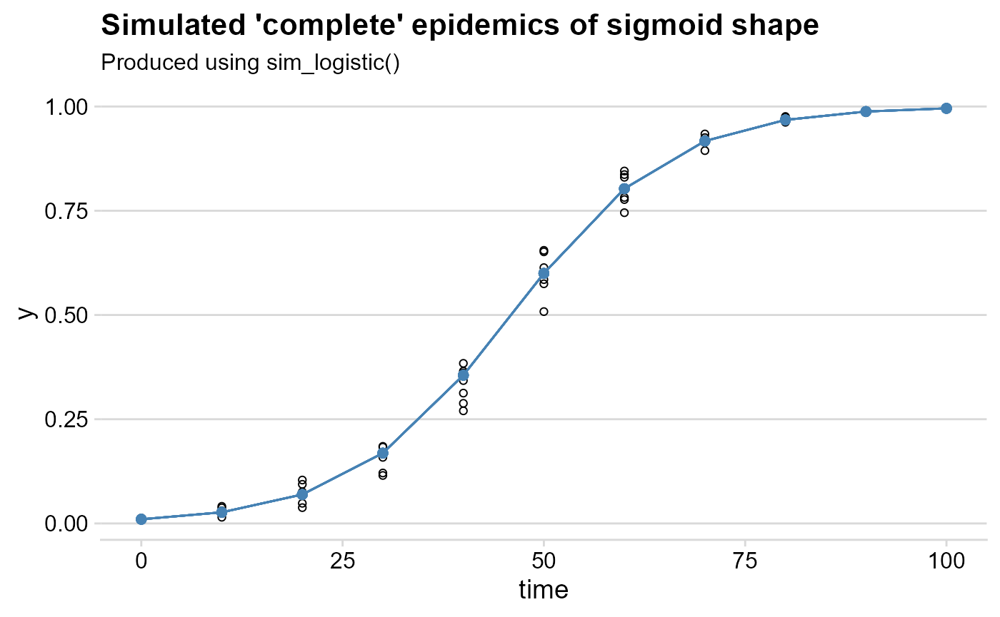
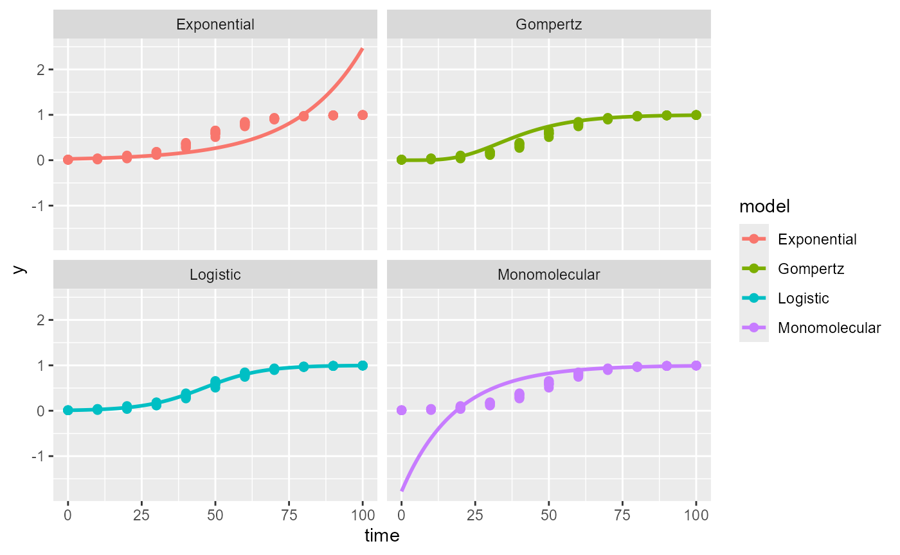
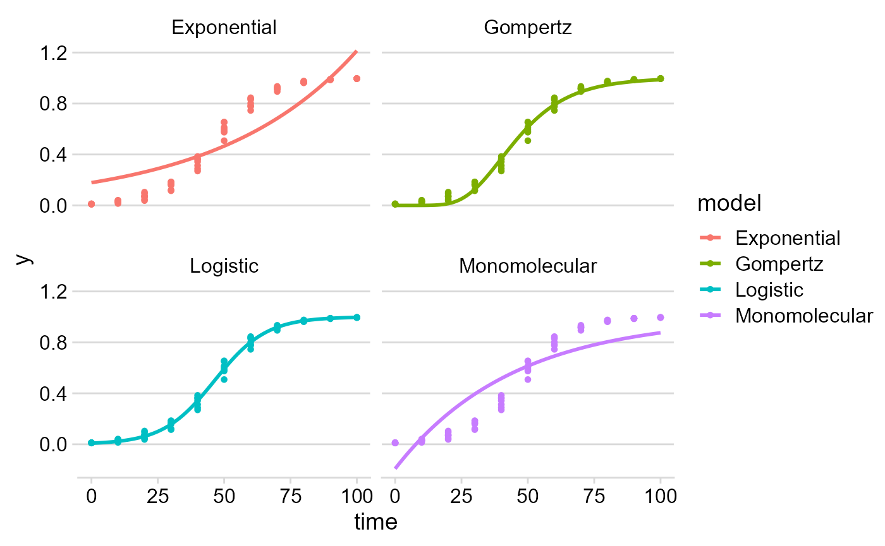
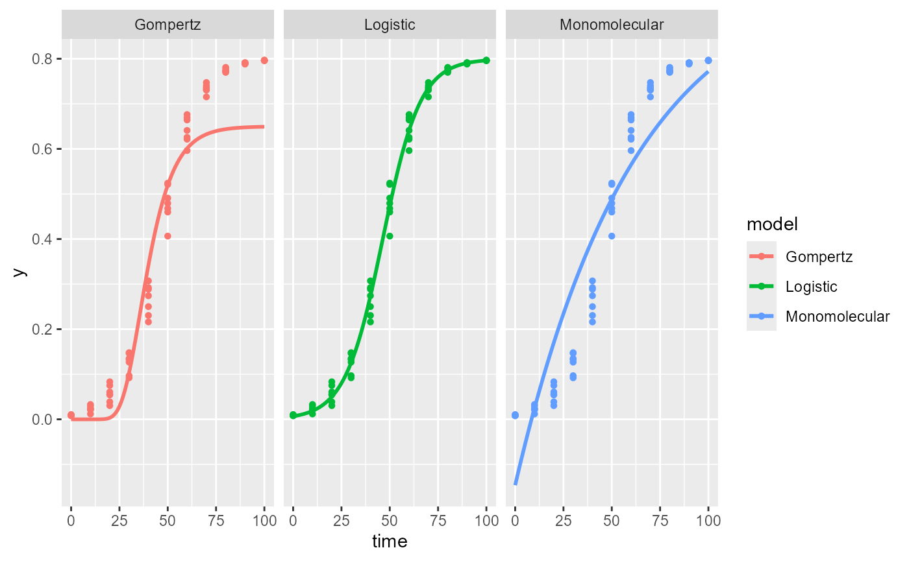
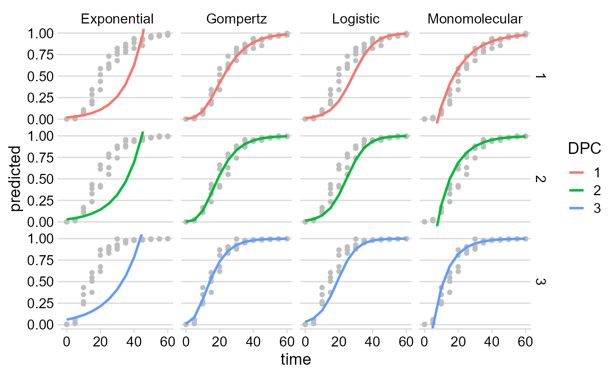
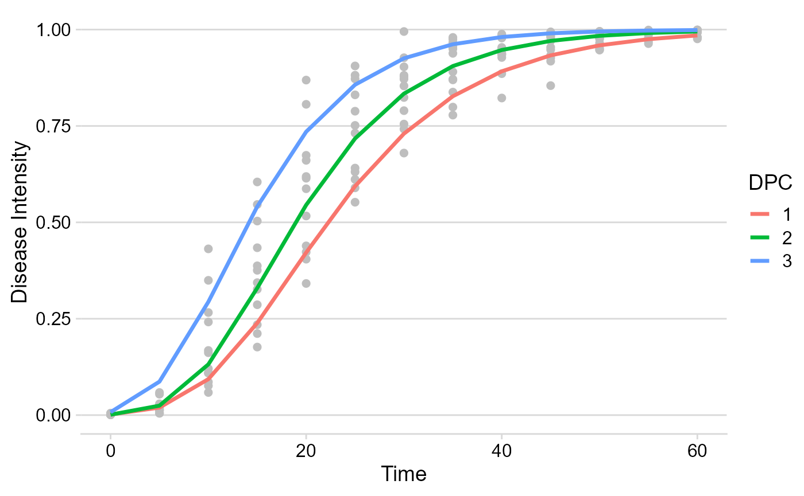

# Fitting and selecting models

## Base functions

`epifitter` provides functions for the fit of (non-flexible)
two-parameter population dynamics models to disease progress curve (DPC)
data: exponential, monomolecular, logistic and Gompertz.

The goal of fitting these models to DPCs is to estimate numerically
meaningful parameters: `y0` that represents primary inoculum and `r`,
representing the apparent infection rate. Hence, the importance of
choosing the model that best describe the epidemics to better understand
its proterties and compare epidemics.

Two approaches can be used to obtain the parameters:

- **Linear regression** models that are fitted to a specific
  transformation of the disease data according to each of the models.
- **Non-linear regression** models fitted to original data

Both approaches are available in *epifitter*. The simplest way to fit
these models to single epidemic data is using the
[`fit_lin()`](https://alvesks.github.io/epifitter/reference/fit_lin.md)
and
[`fit_nlin()`](https://alvesks.github.io/epifitter/reference/fit_nlin.md)
functions. For the latter, the alternative
[`fit_nlin2()`](https://alvesks.github.io/epifitter/reference/fit_nlin2.md)
allows estimating a third parameter, the upper asymptote, when maximum
disease intensity is not close to 100%. The
[`fit_multi()`](https://alvesks.github.io/epifitter/reference/fit_multi.md)
function is the most flexible and allows to fit all models to multiple
epidemic datasets.

First, we need to load the packages we’ll need for this tutorial.

``` r
library(epifitter)
library(ggplot2)
library(dplyr)
library(magrittr)
library(cowplot)
```

## Basic usage

### Dataset

To use *epifitter* data at least two variables are needed, one
representing the time of each assessment of disease intensity during the
course of the epidemics and the other representing a disease intensity
variable as proportion (e.g. incidence, severity, prevalence). For the
case of designed experiments with replicates, a third variable is
needed.

Let’s simulate a DPC dataset for one epidemics measured at replicated
plots. The simulated data resemble a polyciclic epidemics of sigmoid
shape. We can do that using the *epifitter*
[`sim_logistic()`](https://alvesks.github.io/epifitter/reference/sim_logistic.md)
function of epifitter (more about
[`?sim_logistic`](https://alvesks.github.io/epifitter/reference/sim_logistic.md)
here).

``` r
dpcL <- sim_logistic(
  N = 100, # duration of the epidemics in days
  y0 = 0.01, # disease intensity at time zero
  dt = 10, # interval between assessments
  r = 0.1, # apparent infection rate
  alpha = 0.2, # level of noise
  n = 7 # number of replicates
)
```

Let’s give a look at the simulated dataset.

``` r
head(dpcL)
```

    ##   replicates time          y   random_y
    ## 1          1    0 0.01000000 0.01000000
    ## 2          1   10 0.02672668 0.02805496
    ## 3          1   20 0.06946279 0.03795496
    ## 4          1   30 0.16868385 0.16852760
    ## 5          1   40 0.35549349 0.38397525
    ## 6          1   50 0.59989486 0.65502345

The `dpc_L` object generated using
[`sim_logistic()`](https://alvesks.github.io/epifitter/reference/sim_logistic.md)
is a dataframe with four columns. The `y` variable is a vector for the
disease intensity as proportion (0 \< y \< 1). To facilitate
visualization, let’s make a plot using the `ggplot` function of the
*ggplot2* package.

``` r
ggplot(
  dpcL,
  aes(time, y,
    group = replicates
  )
) +
  geom_point(aes(time, random_y), shape = 1) + # plot the replicate values
  geom_point(color = "steelblue", size = 2) +
  geom_line(color = "steelblue") +
  labs(
    title = "Simulated 'complete' epidemics of sigmoid shape",
    subtitle = "Produced using sim_logistic()"
  )+
  theme_minimal_hgrid()
```



### Linear regression using `fit_lin()`

The
[`fit_lin()`](https://alvesks.github.io/epifitter/reference/fit_lin.md)
requires at least the `time` and `y` arguments. In the example, we will
call the `random_y` which represents the replicates. A quick way to call
these variables attached to the dataframe is shown below.

``` r
f_lin <- fit_lin(
  time = dpcL$time,  
  y = dpcL$random_y
)
```

[`fit_lin()`](https://alvesks.github.io/epifitter/reference/fit_lin.md)
outputs a list object which contains several elements. Three elements of
the list are shown by default: stats of model fit, Infection rate and
Initial Inoculum

``` r
f_lin
```

    ## Results of fitting population models 
    ## 
    ## Stats:
    ##                  CCC r_squared    RSE
    ## Exponential   0.9131    0.8402 0.6237
    ## Gompertz      0.9776    0.9563 0.4873
    ## Logistic      0.9977    0.9955 0.2146
    ## Monomolecular 0.9367    0.8809 0.6480
    ## 
    ##  Infection rate:
    ##                 Estimate    Std.error      Lower      Upper         rho
    ## Exponential   0.04462707 0.0022475856 0.04014965 0.04014965 0.007437846
    ## Gompertz      0.07111327 0.0017559327 0.06761527 0.06761527 0.017778316
    ## Logistic      0.09961316 0.0007732535 0.09807276 0.09807276 0.016602194
    ## Monomolecular 0.05498609 0.0023351295 0.05033427 0.05033427 0.027493045
    ## 
    ##  Initial inoculum:
    ##                    Estimate Linearized     lin.SE         Lower         Upper
    ## Exponential    2.846738e-02  -3.558996 0.13296895  2.184279e-02  0.0371010991
    ## Gompertz       3.243387e-05  -2.335663 0.10388238  3.012411e-06  0.0002239497
    ## Logistic       1.014725e-02  -4.580354 0.04574629  9.271593e-03  0.0111046715
    ## Monomolecular -1.776962e+00  -1.021357 0.13814812 -2.656706e+00 -1.1088701071

#### Model fit stats

The `Stats` element of the list shows how each of the four models
predicted the observations based on three measures:

- Lin’s concordance correlation coefficient `CCC` (Lin 2000), a measure
  of agreement that takes both bias and precision into account
- Coefficient of determination `r_squared` (R²), a measure of precision
- Residual standard deviation `RSE` for each model.

The four models are sorted from the high to the low `CCC`. As expected
because the `sim_logistic` function was used to create the synthetic
epidemic data, the the *Logistic* model was superior to the others.

#### Model coefficients

The estimates, and respective standard error and upper and lower 95%
confidence interval, for the two coefficients of interest are shown in
the `Infection rate` and `Initial inoculum` elements. For the latter,
both the back-transformed (estimate) and the linearized estimate are
shown.

#### Global stats

The element `f_lin$stats_all` provides a wide format dataframe with all
the stats for each model.

``` r
f_lin$stats_all
```

    ## # A tibble: 4 × 16
    ##   best_CCC best_RSE model              r     r_se r_ci_lwr r_ci_upr    v0  v0_se
    ##      <dbl>    <dbl> <chr>          <dbl>    <dbl>    <dbl>    <dbl> <dbl>  <dbl>
    ## 1        4        3 Exponential   0.0446 0.00225    0.0401   0.0491 -3.56 0.133 
    ## 2        2        2 Gompertz      0.0711 0.00176    0.0676   0.0746 -2.34 0.104 
    ## 3        1        1 Logistic      0.0996 0.000773   0.0981   0.101  -4.58 0.0457
    ## 4        3        4 Monomolecular 0.0550 0.00234    0.0503   0.0596 -1.02 0.138 
    ## # ℹ 7 more variables: r_squared <dbl>, RSE <dbl>, CCC <dbl>, y0 <dbl>,
    ## #   y0_ci_lwr <dbl>, y0_ci_upr <dbl>, rho <dbl>

#### Model predictions

The predicted values are stored as a dataframe in the `data` element
called using the same `$` operator as above. Both the observed and (`y`)
and the back-transformed predictions (`predicted`) are shown for each
model. The linearized value and the residual are also shown.

``` r
head(f_lin$data)
```

    ##   time          y         model  linearized     predicted      residual
    ## 1    0 0.01000000   Exponential -4.60517019  2.846738e-02 -0.0184673795
    ## 2    0 0.01000000 Monomolecular  0.01005034 -1.776962e+00  1.7869618835
    ## 3    0 0.01000000      Logistic -4.59511985  1.014725e-02 -0.0001472455
    ## 4    0 0.01000000      Gompertz -1.52717963  3.243387e-05  0.0099675661
    ## 5   10 0.02805496   Exponential -3.57358990  4.447955e-02 -0.0164245944
    ## 6   10 0.02805496 Monomolecular  0.02845602 -6.023905e-01  0.6304454777

#### Plot of predictions

The
[`plot_fit()`](https://alvesks.github.io/epifitter/reference/plot_fit.md)
produces, by default, a panel of plots depicting the observed and
predicted values by all fitted models. The arguments `pont_size` and
`line_size` that control for the size of the dots for the observation
and the size of the fitted line, respectively.

``` r
plot_lin <- plot_fit(f_lin,
  point_size = 2,
  line_size = 1
) 

# Default plots
plot_lin 
```



#### Publication-ready plots

The plots are *ggplot2* objects which can be easily customized by adding
new layers that override plot paramaters as shown below. The argument
`models` allows to select the models(s) to be shown on the plot. The
next plot was customized for the logistic model.

``` r
# Customized plots

plot_fit(f_lin,
  point_size = 2,
  line_size = 1,
  models = "Logistic")+
  theme_minimal_hgrid(font_size =18) +
  scale_x_continuous(limits = c(0,100))+
  scale_color_grey()+
   theme(legend.position = "none")+
  labs(
    x = "Time",
    y = "Proportion disease "
    
  )
```


### Non-linear regression

#### Two-parameters

The
[`fit_nlin()`](https://alvesks.github.io/epifitter/reference/fit_nlin.md)
function uses the Levenberg-Marquardt algorithm for least-squares
estimation of nonlinear parameters. In addition to time and disease
intensity, starting values for `y0` and `r` should be given in the
`starting_par` argument. The output format and interpretation is
analogous to the
[`fit_lin()`](https://alvesks.github.io/epifitter/reference/fit_lin.md).

> NOTE: If you encounter error messages saying “matrix at initial
> parameter estimates”, try to modify the starting values for the
> parameters to solve the problem.

``` r
f_nlin <- fit_nlin(
  time = dpcL$time,
  y = dpcL$random_y,
  starting_par = list(y0 = 0.01, r = 0.03)
)

f_nlin
```

    ## Results of fitting population models 
    ## 
    ## Stats:
    ##                  CCC r_squared    RSE
    ## Monomolecular 0.9104    0.8604 0.1583
    ## Exponential   0.8869    0.8245 0.1758
    ## Gompertz      0.9959    0.9933 0.0367
    ## Logistic      0.9982    0.9963 0.0246
    ## 
    ##  Infection rate:
    ##                 Estimate   Std.error      Lower      Upper         rho
    ## Monomolecular 0.02256068 0.001522488 0.01952773 0.01952773 0.011280341
    ## Exponential   0.01916079 0.001407090 0.01635772 0.01635772 0.003193465
    ## Gompertz      0.07226209 0.002129110 0.06802069 0.06802069 0.018065522
    ## Logistic      0.10250959 0.002086494 0.09835308 0.09835308 0.017084931
    ## 
    ##  Initial inoculum:
    ##                    Estimate    Std.error         Lower         Upper
    ## Monomolecular -1.921273e-01 4.726510e-02 -2.862843e-01 -9.797042e-02
    ## Exponential    1.787016e-01 2.092668e-02  1.370135e-01  2.203897e-01
    ## Gompertz       1.466893e-08 2.542713e-08 -3.598450e-08  6.532236e-08
    ## Logistic       8.533242e-03 8.419049e-04  6.856081e-03  1.021040e-02

We can check the results using `plot_fit`.

``` r
plot_fit(f_nlin) +
  theme_minimal_hgrid()#changing plot theme
```



### Estimating `K` (maximum disease)

In many epidemics the last measure (final time) of a DPC does not reach
the maximum intensity and, for this reason, estimation of maximum
asymptote (carrying capacity `K`) may be necessary. The `fin_lin2()`
provides an estimation of `K` in addition to the estimates provided by
[`fit_lin()`](https://alvesks.github.io/epifitter/reference/fit_lin.md).

Before demonstrating the function, we can transform our simulated data
by creating another variable with `y_random2` with maximum about 0.8
(80%). Simplest way is to multiply the `y_random` by 0.8.

``` r
dpcL2 = dpcL %>% 
  mutate(random_y = random_y * 0.8)
```

Then we run the
[`fit_nlin2()`](https://alvesks.github.io/epifitter/reference/fit_nlin2.md)
for the new dataset.

``` r
f_nlin2 <- fit_nlin2(
  time = dpcL2$time,
  y = dpcL2$random_y,
  starting_par = list(y0 = 0.01, r = 0.2, K =  0.6)
)
f_nlin2
```

    ## Results of fitting population models 
    ## 
    ## Stats:
    ##                  CCC r_squared    RSE
    ## Monomolecular 0.9433    0.8999 0.1047
    ## Gompertz      0.9570    0.9600 0.0904
    ## Logistic      0.9982    0.9963 0.0198
    ## 
    ##  Infection rate:
    ##                 Estimate   Std.error       Lower       Upper         rho
    ## Monomolecular 0.01614355 0.003189458 0.009788412 0.009788412 0.008071774
    ## Gompertz      0.10526637 0.016684801 0.072021174 0.072021174 0.017103039
    ## Logistic      0.10267337 0.002532523 0.097627206 0.097627206 0.013680288
    ## 
    ##  Initial inoculum:
    ##                    Estimate    Std.error         Lower         Upper
    ## Monomolecular -1.462051e-01 3.334841e-02 -2.126533e-01 -7.975695e-02
    ## Gompertz       1.006691e-19 2.696818e-18 -5.272859e-18  5.474197e-18
    ## Logistic       6.784477e-03 7.643834e-04  5.261410e-03  8.307544e-03
    ## 
    ##  Maximum disease intensity:
    ##                Estimate   Std.error     Lower     Upper
    ## Monomolecular 1.0000000 0.112171775 0.7764929 1.2235071
    ## Gompertz      0.6498957 0.018713653 0.6126079 0.6871834
    ## Logistic      0.7994452 0.004854938 0.7897715 0.8091189

``` r
plot_fit(f_nlin2)
```



> NOTE: The exponential model is not included because it doesn’t have a
> maximum asymptote. The estimated value of `K` is the expected 0.8.

### Fit models to multiple DPCs

Most commonly, there are more than one epidemics to analyse either from
observational or experimental studies. When the goal is to fit a common
model to all curves, the
[`fit_multi()`](https://alvesks.github.io/epifitter/reference/fit_multi.md)
function is in hand. Each DPC needs an unique identified to further
combined in a single data frame.

#### Data

Let’s use the `sim_` family of functions to create three epidemics and
store the data in a single `data.frame`. The Gompertz model was used to
simulate these data. Note that we allowed to the `y0` and `r` parameter
to differ the DPCs. We should combine the three DPCs using the
[`bind_rows()`](https://dplyr.tidyverse.org/reference/bind_rows.html)
function and name the identifier (`.id`), automatically created as a
character vector, for each epidemics as ‘DPC’.

``` r
epi1 <- sim_gompertz(N = 60, y0 = 0.001, dt = 5, r = 0.1, alpha = 0.4, n = 4)
epi2 <- sim_gompertz(N = 60, y0 = 0.001, dt = 5, r = 0.12, alpha = 0.4, n = 4)
epi3 <- sim_gompertz(N = 60, y0 = 0.003, dt = 5, r = 0.14, alpha = 0.4, n = 4)

multi_epidemic <- bind_rows(epi1,
  epi2,
  epi3,
  .id = "DPC"
)
head(multi_epidemic)
```

    ##   DPC replicates time          y  random_y
    ## 1   1          1    0 0.00100000 0.0010000
    ## 2   1          1    5 0.01515505 0.0161830
    ## 3   1          1   10 0.07878459 0.0761623
    ## 4   1          1   15 0.21411521 0.3436388
    ## 5   1          1   20 0.39266393 0.5165197
    ## 6   1          1   25 0.56723412 0.6407593

We can visualize the three DPCs in a same plot

``` r
p_multi <- ggplot(multi_epidemic,
       aes(time, y, shape = DPC, group = DPC))+
  geom_point(size =2)+
  geom_line()+
  theme_minimal_grid(font_size =18) +
   labs(
    x = "Time",
    y = "Proportion disease "
    
  )
p_multi
```


Or use
[`facet_wrap()`](https://ggplot2.tidyverse.org/reference/facet_wrap.html)
for ploting them separately.

``` r
p_multi +
  facet_wrap(~ DPC, ncol = 1)
```


#### Using `fit_multi()`

[`fit_multi()`](https://alvesks.github.io/epifitter/reference/fit_multi.md)
requires at least four arguments: time, disease intensity (as
proportion), data and the curve identifier (`strata_cols`). The latter
argument accepts one or more strata include as `c("strata1",strata2")`.
In the example below, the stratum name is `DPC`, the name of the
variable.

By default, the linear regression is fitted to data but adding another
argument `nlin = T`, the non linear regressions is fitted instead.

``` r
multi_fit <- fit_multi(
  time_col = "time",
  intensity_col = "random_y",
  data = multi_epidemic,
  strata_cols = "DPC"
)
```

All parameters of the list can be returned using the \$ operator as
below.

``` r
head(multi_fit$Parameters)
```

    ##   DPC best_CCC best_RSE         model          r        r_se   r_ci_lwr
    ## 1   1        4        4   Exponential 0.08720308 0.009444138 0.06823397
    ## 2   1        1        1      Gompertz 0.10102180 0.002730769 0.09553689
    ## 3   1        3        3      Logistic 0.16024027 0.008078777 0.14401357
    ## 4   1        2        2 Monomolecular 0.07303719 0.003169107 0.06667185
    ## 5   2        4        4   Exponential 0.07879947 0.009326907 0.06006583
    ## 6   2        1        1      Gompertz 0.12062152 0.003109453 0.11437600
    ##     r_ci_upr         v0      v0_se r_squared       RSE       CCC           y0
    ## 1 0.10617219 -3.9543070 0.33390069 0.6303382 1.2740838 0.7732607  0.019171950
    ## 2 0.10650671 -1.8739859 0.09654726 0.9647527 0.3684008 0.9820602  0.001482226
    ## 3 0.17646697 -4.5240801 0.28562789 0.8872391 1.0898865 0.9402509  0.010728341
    ## 4 0.07940253 -0.5697731 0.11204484 0.9139632 0.4275358 0.9550478 -0.767865817
    ## 5 0.09753311 -3.5215036 0.32975595 0.5880676 1.2582685 0.7406078  0.029554962
    ## 6 0.12686704 -1.9129374 0.10993576 0.9678417 0.4194881 0.9836581  0.001144309
    ##       y0_ci_lwr    y0_ci_upr        rho
    ## 1  0.0098039856  0.037491250 0.01453385
    ## 2  0.0003676966  0.004673228 0.02525545
    ## 3  0.0060731840  0.018883928 0.02670671
    ## 4 -1.2140462925 -0.411600813 0.03651859
    ## 5  0.0152399053  0.057316352 0.01313325
    ## 6  0.0002146545  0.004378676 0.03015538

Similarly, all data can be returned.

``` r
head(multi_fit$Data)
```

    ##   DPC time        y         model  linearized    predicted      residual
    ## 1   1    0 0.001000   Exponential -6.90775528  0.019171950 -0.0181719501
    ## 2   1    0 0.001000 Monomolecular  0.00100050 -0.767865817  0.7688658171
    ## 3   1    0 0.001000      Logistic -6.90675478  0.010728341 -0.0097283408
    ## 4   1    0 0.001000      Gompertz -1.93264473  0.001482226 -0.0004822264
    ## 5   1    5 0.016183   Exponential -4.12379417  0.029650046 -0.0134670497
    ## 6   1    5 0.016183 Monomolecular  0.01631537 -0.227018356  0.2432013529

If nonlinear regression is preferred, the `nlim` argument should be set
to `TRUE`

``` r
multi_fit2 <- fit_multi(
  time_col = "time",
  intensity_col = "random_y",
  data = multi_epidemic,
  strata_cols = "DPC",
  nlin = TRUE)
```

    ## Warning in log(y0/1): NaNs produced
    ## Warning in log(y0/1): NaNs produced
    ## Warning in log(y0/1): NaNs produced
    ## Warning in log(y0/1): NaNs produced
    ## Warning in log(y0/1): NaNs produced
    ## Warning in log(y0/1): NaNs produced
    ## Warning in log(y0/1): NaNs produced
    ## Warning in log(y0/1): NaNs produced

``` r
head(multi_fit2$Parameters)
```

    ##   DPC         model          y0       y0_se          r        r_se df       CCC
    ## 1   1 Monomolecular -0.17494390 0.042127605 0.04545796 0.002673725 50 0.9556734
    ## 2   1   Exponential  0.25125912 0.031477327 0.02591525 0.002625527 50 0.8475924
    ## 3   1      Gompertz  0.00181047 0.001075200 0.10340023 0.004305483 50 0.9925210
    ## 4   1      Logistic  0.03535149 0.006724844 0.14888188 0.008392131 50 0.9874503
    ## 5   2 Monomolecular -0.16632959 0.044842130 0.05171736 0.003253205 50 0.9539950
    ## 6   2   Exponential  0.29176518 0.035659144 0.02381234 0.002601039 50 0.8227586
    ##   r_squared        RSE     y0_ci_lwr    y0_ci_upr   r_ci_lwr   r_ci_upr
    ## 1 0.9256748 0.10758355 -0.2595596876 -0.090328118 0.04008763 0.05082830
    ## 2 0.7652372 0.18801088  0.1880350459  0.314483188 0.02064172 0.03118877
    ## 3 0.9853805 0.04634565 -0.0003491322  0.003970072 0.09475242 0.11204805
    ## 4 0.9782763 0.05984514  0.0218442454  0.048858738 0.13202579 0.16573797
    ## 5 0.9242815 0.11088567 -0.2563976561 -0.076261520 0.04518311 0.05825161
    ## 6 0.7302975 0.20351664  0.2201416826  0.363388681 0.01858800 0.02903668
    ##           rho best_CCC best_RSE
    ## 1 0.022728982        3        3
    ## 2 0.004319208        4        4
    ## 3 0.025850058        1        1
    ## 4 0.024813647        2        2
    ## 5 0.025858680        3        3
    ## 6 0.003968723        4        4

#### Want to estimate K?

If you want to estimate `K`, set `nlin = TRUE` and `estimate_K = TRUE`.

> NOTE: If you do not set both arguments `TRUE`, `K` will not be
> estimated, because `nlin` defaut is `FALSE`. Also remember that when
> estimating K, we don’t fit the *Exponential* model.

``` r
multi_fit_K <- fit_multi(
  time_col = "time",
  intensity_col = "random_y",
  data = multi_epidemic,
  strata_cols = "DPC",
  nlin = T,
  estimate_K = T
)
```

    ## Warning in log(y0/K): NaNs produced
    ## Warning in log(y0/K): NaNs produced
    ## Warning in log(y0/K): NaNs produced
    ## Warning in log(y0/K): NaNs produced
    ## Warning in log(y0/K): NaNs produced
    ## Warning in log(y0/K): NaNs produced
    ## Warning in log(y0/K): NaNs produced

``` r
head(multi_fit_K$Parameters)
```

    ##   DPC         model           y0       y0_se          r        r_se K
    ## 1   1 Monomolecular -0.174945153 0.046253628 0.04545809 0.006550384 1
    ## 2   1      Gompertz  0.001810474 0.001313090 0.10340021 0.006290898 1
    ## 3   1      Logistic  0.035351469 0.007520978 0.14888186 0.010229411 1
    ## 4   2 Monomolecular -0.166326036 0.048474509 0.05171694 0.007018590 1
    ## 5   2      Gompertz  0.001859921 0.001530572 0.11566069 0.007744006 1
    ## 6   2      Logistic  0.034783345 0.007321525 0.16673298 0.011056257 1
    ##         K_se df       CCC r_squared        RSE     y0_ci_lwr    y0_ci_upr
    ## 1 0.05871370 49 0.9556735 0.9256745 0.10867580 -0.2678952986 -0.081995008
    ## 2 0.01569255 49 0.9925210 0.9853805 0.04681618 -0.0008282795  0.004449227
    ## 3 0.01678041 49 0.9874503 0.9782763 0.06045272  0.0202374979  0.050465440
    ## 4 0.04990953 49 0.9539948 0.9242823 0.11201144 -0.2637392094 -0.068912862
    ## 5 0.01514054 49 0.9906392 0.9815300 0.05280857 -0.0012158794  0.004935721
    ## 6 0.01417623 49 0.9887393 0.9789074 0.05772124  0.0200701889  0.049496501
    ##     r_ci_lwr   r_ci_upr  K_ci_lwr K_ci_upr        rho best_CCC best_RSE
    ## 1 0.03229460 0.05862158 0.8820104 1.117990 0.02272904        3        3
    ## 2 0.09075817 0.11604224 0.9684646 1.031535 0.02585005        1        1
    ## 3 0.12832509 0.16943863 0.9662785 1.033721 0.02481364        2        2
    ## 4 0.03761256 0.06582133 0.8997030 1.100297 0.02585847        3        3
    ## 5 0.10009852 0.13122285 0.9695739 1.030426 0.02891517        1        1
    ## 6 0.14451460 0.18895137 0.9715118 1.028488 0.02778883        2        2

### Graphical outputs

Use [`ggplot2`](https://ggplot2.tidyverse.org/) to produce elegant data
visualizations of models curves and the estimated parameters.

#### DPCs and fitted curves

The original data and the predicted values by each model are stored in
`multi_fit$Data`. A nice plot can be produced as follows:

``` r
multi_fit$Data %>%
  ggplot(aes(time, predicted, color = DPC)) +
  geom_point(aes(time, y), color = "gray") +
  geom_line(size = 1) +
  facet_grid(DPC ~ model, scales = "free_y") +
  theme_minimal_hgrid()+
  coord_cartesian(ylim = c(0, 1))
```

    ## Warning: Using `size` aesthetic for lines was deprecated in ggplot2 3.4.0.
    ## ℹ Please use `linewidth` instead.
    ## This warning is displayed once per session.
    ## Call `lifecycle::last_lifecycle_warnings()` to see where this warning was
    ## generated.



Using the *dplyr* function `filter` only the model of interest can be
chosen for plotting.

``` r
multi_fit$Data %>%
  filter(model == "Gompertz") %>%
  ggplot(aes(time, predicted, color = DPC)) +
  geom_point(aes(time, y),
    color = "gray",
    size = 2
  ) +
  geom_line(size = 1.2) +
  theme_minimal_hgrid() +
  labs(
    x = "Time",
    y = "Disease Intensity"
  )
```



#### Apparent infection rate

The `multi_fit$Parameters` element is where all stats and parameters as
stored. Let’s plot the estimates of the apparent infection rate.

``` r
multi_fit$Parameters %>%
  filter(model == "Gompertz") %>%
  ggplot(aes(DPC, r)) +
  geom_point(size = 3) +
  geom_errorbar(aes(ymin = r_ci_lwr, ymax = r_ci_upr),
    width = 0,
    size = 1
  ) +
  labs(
    x = "Time",
    y = "Apparent infection rate"
  ) +
  theme_minimal_hgrid()
```


## References

Lin L (2000). A note on the concordance correlation coefficient.
Biometrics 56: 324 - 325.
