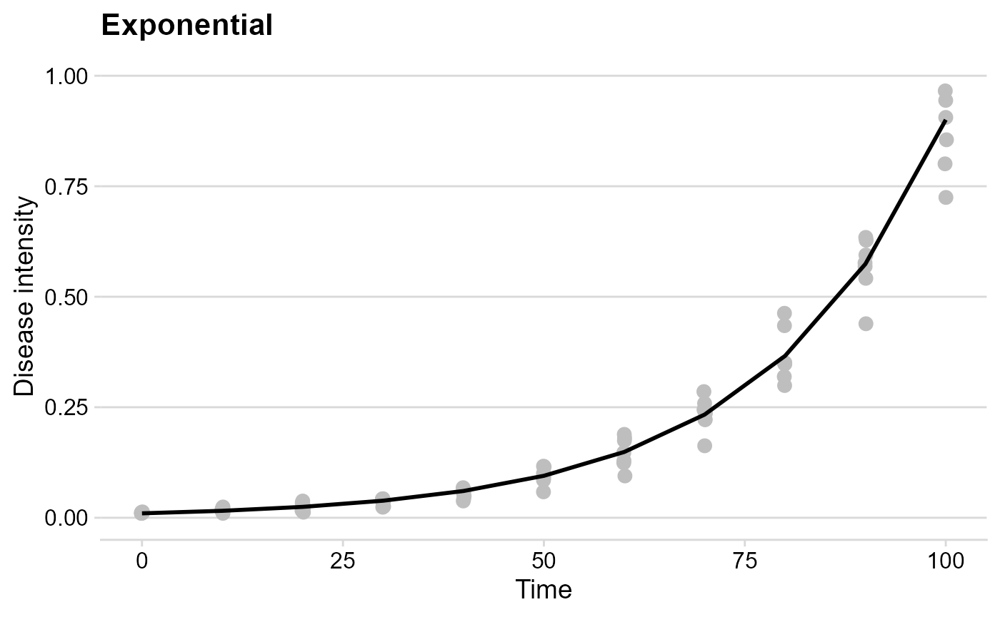
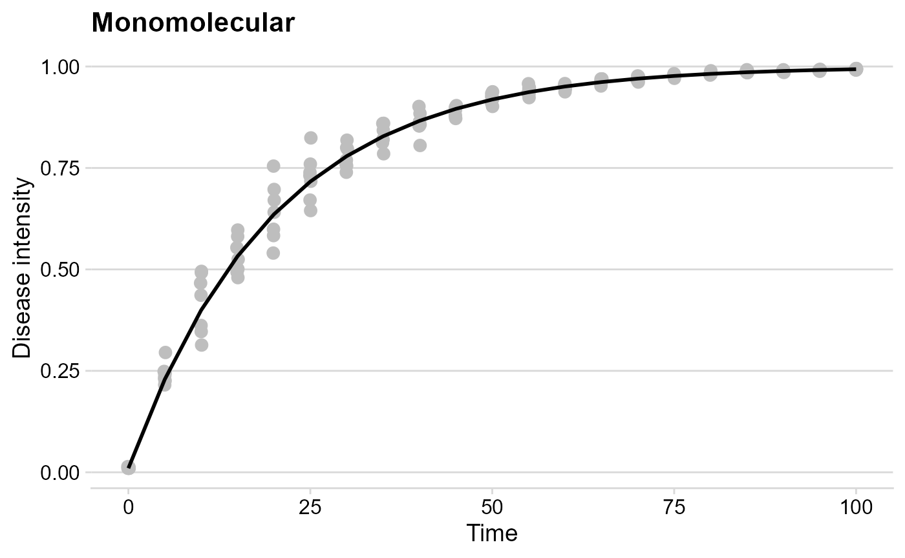
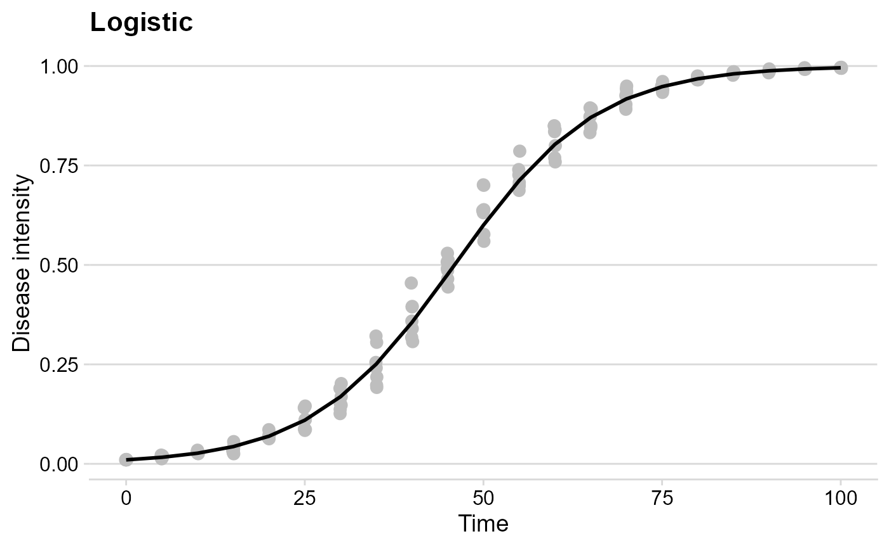
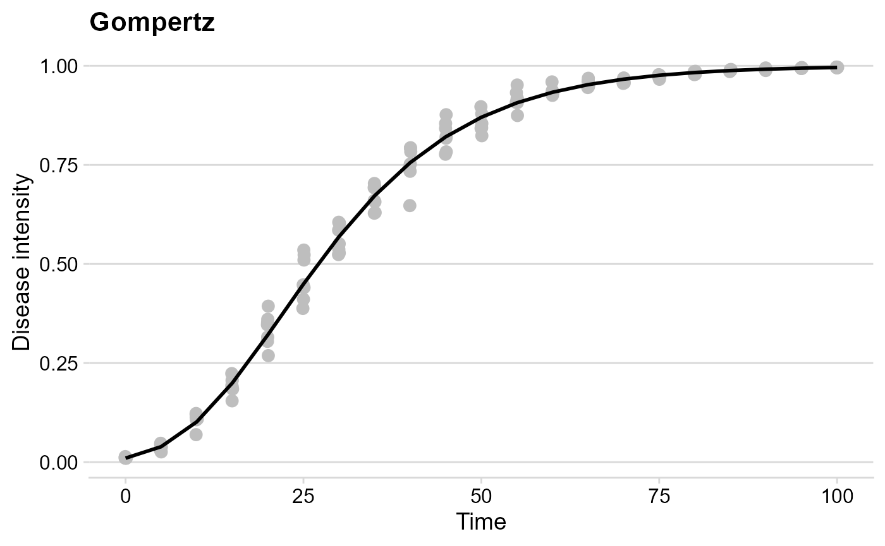
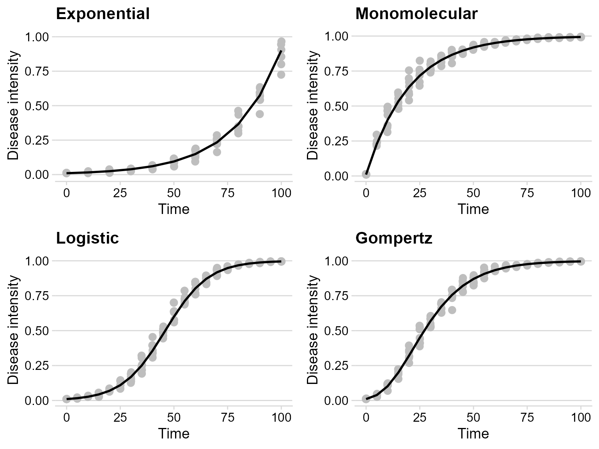

# Simulating disease progress curves

## Introduction

In `epiffiter`, opposite to the `fit_` functions (estimate parameters
from fitting models to the data), the `sim_` family of functions allows
to produce the DPC data given a set of parameters for a specific model.
Currently, the same four population dynamic models that are fitted to
the data can be simulated.

The functions use the `ode()` function of the `devolve` package
(Soetaert,Petzoldt & Setzer 2010) to solve the differential equation
form of the e epidemiological models.

## Hands On

### Packages

First, we need to load the packages we’ll need for this tutorial.

``` r
library(epifitter)
library(magrittr)
library(ggplot2)
library(cowplot)
```

### The basics of the simulation

The `sim_` functions, regardless of the model, require the same set of
six arguments. By default, at least two arguments are required (the
others have default values)

- `r`: apparent infection rate
- `n`: number of replicates

When `n` is greater than one, replicated epidemics (e.g. replicated
treatments) are produced and a level of noise (experimental error)
should be set in the `alpha` argument. These two arguments combined set
will generate `random_y` values, which will vary randomly across the
defined number of replicates.

The other arguments are:

- `N`: epidemic duration in time units
- `dt`: time (fixed) in units between two assessments
- `y0`: initial inoculum
- `alpha`: noise parameters for the replicates

#### Exponential

Let’s simulate a curve resembling the exponential growth.

``` r
exp_model <- sim_exponential(
  N = 100,    # total time units 
  y0 = 0.01,  # initial inoculum
  dt = 10,    #  interval between assessments in time units
  r = 0.045,  #  apparent infection rate
  alpha = 0.2,# level of noise
  n = 7       # number of replicates
)
head(exp_model)
```

    ##   replicates time          y   random_y
    ## 1          1    0 0.01000000 0.01000000
    ## 2          1   10 0.01568425 0.01648514
    ## 3          1   20 0.02459905 0.01260818
    ## 4          1   30 0.03858028 0.03853729
    ## 5          1   40 0.06050749 0.06802921
    ## 6          1   50 0.09489670 0.11669280

A `data.frame` object is produced with four columns:

- `replicates`: the curve with the respective ID number
- `time`: the assessment time
- `y`: the simulated proportion of disease intensity
- `random_y`: randomly simulated proportion disease intensity based on
  the noise

Use the [`ggplot2`](https://ggplot2.tidyverse.org/) package to build
impressive graphics!

``` r
exp_plot = exp_model %>%
  ggplot(aes(time, y)) +
  geom_jitter(aes(time, random_y), size = 3,color = "gray", width = .1) +
  geom_line(size = 1) +
  theme_minimal_hgrid() +
  ylim(0,1)+
  labs(
    title = "Exponential",
    y = "Disease intensity",
    x = "Time"
  )
```

    ## Warning: Using `size` aesthetic for lines was deprecated in ggplot2 3.4.0.
    ## ℹ Please use `linewidth` instead.
    ## This warning is displayed once per session.
    ## Call `lifecycle::last_lifecycle_warnings()` to see where this warning was
    ## generated.

``` r
exp_plot
```

    ## Warning: Removed 1 row containing missing values or values outside the scale range
    ## (`geom_point()`).



#### Monomolecular

The logic is exactly the same here.

``` r
mono_model <- sim_monomolecular(
  N = 100,
  y0 = 0.01,
  dt = 5,
  r = 0.05,
  alpha = 0.2,
  n = 7
)
head(mono_model)
```

    ##   replicates time         y   random_y
    ## 1          1    0 0.0100000 0.01034092
    ## 2          1    5 0.2289861 0.22579664
    ## 3          1   10 0.3995322 0.49186456
    ## 4          1   15 0.5323535 0.59700132
    ## 5          1   20 0.6357949 0.67047285
    ## 6          1   25 0.7163551 0.73895902

``` r
mono_plot = mono_model %>%
  ggplot(aes(time, y)) +
  geom_jitter(aes(time, random_y), size = 3, color = "gray", width = .1) +
  geom_line(size = 1) +
  theme_minimal_hgrid() +
  labs(
    title = "Monomolecular",
    y = "Disease intensity",
    x = "Time"
  )
mono_plot
```



#### The Logistic model

``` r
logist_model <- sim_logistic(
  N = 100,
  y0 = 0.01,
  dt = 5,
  r = 0.1,
  alpha = 0.2,
  n = 7
)
head(logist_model)
```

    ##   replicates time          y   random_y
    ## 1          1    0 0.01000000 0.01067404
    ## 2          1    5 0.01638216 0.01485875
    ## 3          1   10 0.02672677 0.03041405
    ## 4          1   15 0.04331509 0.03064342
    ## 5          1   20 0.06946352 0.07253287
    ## 6          1   25 0.10958806 0.08396757

``` r
logist_plot = logist_model %>%
  ggplot(aes(time, y)) +
  geom_jitter(aes(time, random_y), size = 3,color = "gray", width = .1) +
  geom_line(size = 1) +
  theme_minimal_hgrid() +
  labs(
    title = "Logistic",
    y = "Disease intensity",
    x = "Time"
  )
logist_plot
```



#### Gompertz

``` r
gomp_model <- sim_gompertz(
  N = 100,
  y0 = 0.01,
  dt = 5,
  r = 0.07,
  alpha = 0.2,
  n = 7
)
head(gomp_model)
```

    ##   replicates time          y  random_y
    ## 1          1    0 0.01000000 0.0100000
    ## 2          1    5 0.03896283 0.0475927
    ## 3          1   10 0.10158896 0.1089836
    ## 4          1   15 0.19958740 0.1845412
    ## 5          1   20 0.32122825 0.3154174
    ## 6          1   25 0.44922018 0.5099217

``` r
gomp_plot = gomp_model %>%
  ggplot(aes(time, y)) +
  geom_jitter(aes(time, random_y), size = 3,color = "gray", width = .1) +
  geom_line(size = 1) +
  theme_minimal_hgrid() +
  labs(
    title = "Gompertz",
    y = "Disease intensity",
    x = "Time"
  )
gomp_plot
```



### Combo

Use the function
[`plot_grid()`](https://wilkelab.org/cowplot/reference/plot_grid.html)
from the [`cowplot`](https://wilkelab.org/cowplot/index.html) package to
gather all plots into a grid

``` r
plot_grid(exp_plot,
          mono_plot,
          logist_plot,
          gomp_plot)
```

    ## Warning: Removed 1 row containing missing values or values outside the scale range
    ## (`geom_point()`).



## References

Karline Soetaert, Thomas Petzoldt, R. Woodrow Setzer (2010). Solving
Differential Equations in R: Package deSolve. Journal of Statistical
Software, 33(9), 1–25. DOI:
[10.18637/jss.v033.i09](http://dx.doi.org/10.18637/jss.v033.i09)
